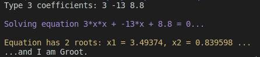

# Programm for solving square equations

## How to build project

To compile the project to file "main" run "Makefile" in the root directory

## Examples of work

### Equation with 2 roots:

### Equation with no roots:

